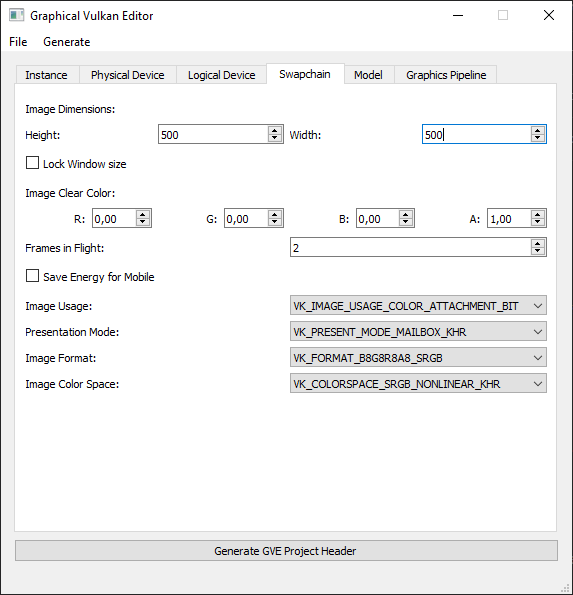

# Graphical Vulkan Editor

The repository presents the development of a scientific project called **Graphical Vulkan Editor (GVE)**. It focuses on implementing a graphical user interface for creating Vulkan-based applications. The project is a collaboration between the Research Group Education, Didactics, and Entertainment Computing (EDEN) at the University of Vienna, under the supervision of [Univ.-Prof. Dr. Helmut Hlavacs](http://entertain.univie.ac.at/~hlavacs/).

## Overview

The Graphical Vulkan Editor aims to facilitate configuration management and parameter adjustments for Vulkan-based applications. It provides a user-friendly interface for modifying Vulkan configurations and exporting the settings for the included VulkanProject application. The project incorporates code and concepts from the Vulkan tutorial by Alexander Overvoorde.

## Screenshots

Here are some screenshots of the Graphical Vulkan Editor interface:

|  Section to change swapchain details such as width and height.  |  Section to load model and texture.  |
|:---:|:---:|
|  |  |

|  Section to add edit and preview graphics pipelines.  |  Possible output when running the attached Vulkan application with the exported header from the GVE.  |
|:---:|:---:|
|  |  |

## Usage

1. Start the Graphical Vulkan Editor GUI by navigating to the `GraphicalVulkanEditor` folder and running the corresponding executable or script.

2. Within the GUI, you can load existing configurations, check and modify parameters, and save the configurations for future use.

3. To export the configurations, click the "Generate/Export" button. This action generates a `GraphicalVulkanEditorProjectVariables.h` file in the parent directory (`../GraphicalVulkanEditorProjectVariables.h`).

4. Build and run the `VulkanProject` C++ application using your preferred Vulkan development environment.

5. The `VulkanProject` application will now utilize the configurations from the exported `GraphicalVulkanEditorProjectVariables.h` file, allowing for immediate usage of the modified parameters.

### Folder Structure

- `GraphicalVulkanEditor/`: Contains the Graphical Vulkan Editor files and executable/script.
- `resources/`: Includes essential resource files, including assets, for both the GVE and the accompanying Vulkan application.
- `GraphicalVulkanEditorProjectVariables.h`: The exported configuration file generated by the Graphical Vulkan Editor.
- `VulkanProject.sln`: Contains the VulkanProject source code.

## Usage of the VulkanProject.h C++ project

1. Clone the repository: `git clone https://github.com/Schokolado/GraphicalVulkanEditor.git`
2. Modify the .vcxproj file to include the appropriate directories for libraries. Update the paths in to match your own directories in the following sections at `Project` -> `Properties`:
   * `C++` -> `General` -> `Additional Include Directories`
   * `Linker` -> `General` -> `Additional Library Directories`
3. For the Release configuration, add `shaderc_combined.lib` to `Linker` -> `Input` -> `Additional Dependencies`.
4. For the Debug configuration, add `shaderc_combinedd.lib` to `Linker` -> `Input` -> `Additional Dependencies` (note the additional `d` for debug on the `shaderc` library). 
5. Run the GVE-GUI and export the configuration
6. Build and run the project using your preferred Vulkan development environment.
7. To quickly modify configuration parameters and instantly observe the updated outcome, repeat steps 5 and 6.

## License

- The code from the Vulkan tutorial is available under the Creative Commons Zero v1.0 Universal license (CC0 1.0), which allows unrestricted use, modification, and distribution without requiring attribution. License details can be found [here](https://creativecommons.org/publicdomain/zero/1.0/).
- The materials in this repository are generally licensed under [CC BY-SA 4.0 License](https://creativecommons.org/licenses/by-sa/4.0/), unless indicated otherwise. By contributing to this repository, you agree to license your contributions under the same license.
- Specifically, the resources found in the resources directory and the VulkanProject.h file are licensed under [CC0 1.0 Universal](https://creativecommons.org/publicdomain/zero/1.0/). By contributing to that directory and files, you agree to license your contributions under the same public domain-like license.

## Vulkan Tutorial Acknowledgment

This project utilizes code and concepts from the Vulkan tutorial by Alexander Overvoorde available at [vulkan-tutorial.com](https://vulkan-tutorial.com/).

- Tutorial Author: Alexander Overvoorde
- Tutorial License: Creative Commons Attribution-ShareAlike 4.0 International License (CC BY-SA 4.0)
- Tutorial License Details: [CC BY-SA 4.0 License](https://creativecommons.org/licenses/by-sa/4.0/)

Special thanks to Alexander Overvoorde for the comprehensive and well-explained Vulkan tutorial, which greatly contributed to the understanding and implementation of Vulkan in this project. Proper attribution is given throughout the VulkanProject codebase.

## Contribution Guidelines
- After updating the Python project, create a new executable using the following command:
  - `pyinstaller .\GraphicalVulkanEditor\GraphicalVulkanEditor.py --onefile -w`

## Links
- http://entertain.univie.ac.at/~hlavacs/
- https://vulkan-tutorial.com/